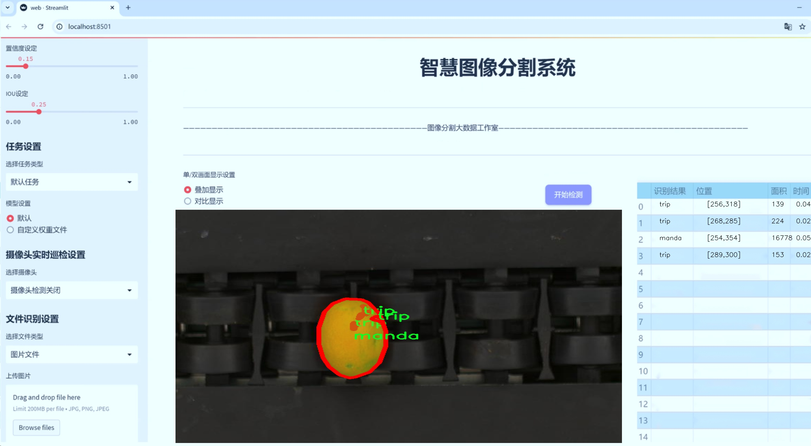
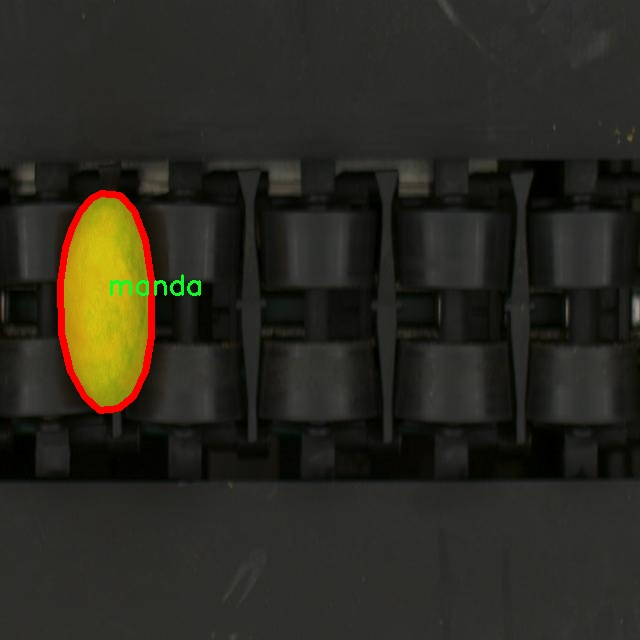

# 生产线水果病害分割系统源码＆数据集分享
 [yolov8-seg-C2f-DiverseBranchBlock＆yolov8-seg-C2f-RFAConv等50+全套改进创新点发刊_一键训练教程_Web前端展示]

### 1.研究背景与意义

项目参考[ILSVRC ImageNet Large Scale Visual Recognition Challenge](https://gitee.com/YOLOv8_YOLOv11_Segmentation_Studio/projects)

项目来源[AAAI Global Al lnnovation Contest](https://kdocs.cn/l/cszuIiCKVNis)

研究背景与意义

随着全球农业生产的不断发展，水果种植业在满足人们日益增长的食品需求方面发挥着重要作用。然而，水果在生长过程中常常受到各种病害的侵袭，这不仅影响了水果的产量和品质，还可能对消费者的健康构成威胁。因此，及时、准确地识别和分割水果病害，对于提高农业生产效率、保障食品安全具有重要的现实意义。传统的病害识别方法往往依赖于人工观察，效率低下且容易受到主观因素的影响。随着计算机视觉技术的快速发展，基于深度学习的图像处理方法逐渐成为解决这一问题的有效手段。

YOLO（You Only Look Once）系列模型作为一种高效的目标检测算法，近年来在图像分割和物体识别领域取得了显著的成果。YOLOv8作为该系列的最新版本，结合了多种先进的深度学习技术，具有更高的检测精度和更快的处理速度。通过对YOLOv8进行改进，构建一个专门针对水果病害的分割系统，不仅能够提升病害识别的准确性，还能在生产线上实现实时监测，从而为农业生产提供有力的技术支持。

本研究所使用的数据集包含5400张图像，涵盖了六类水果病害，包括dm（果实腐烂）、manda（霉变）、necro（枯萎）、pedu（果实变色）、sp（斑点）和trip（虫害）。这些数据的多样性和丰富性为模型的训练提供了良好的基础，使得改进后的YOLOv8能够在不同类型的病害识别中表现出色。通过对这些病害进行精确的分割，能够帮助农民及时发现问题，采取相应的防治措施，从而减少损失，提高水果的市场竞争力。

此外，基于改进YOLOv8的水果病害分割系统的研究，不仅具有重要的学术价值，还有广泛的应用前景。随着农业智能化的发展，越来越多的农场开始引入智能监测系统，以提高生产效率和管理水平。通过将本研究的成果应用于实际生产中，可以实现对水果病害的自动化监测和处理，降低人工成本，提高工作效率。同时，该系统还可以与其他农业管理系统进行集成，形成一个完整的智能农业解决方案，推动农业现代化进程。

综上所述，基于改进YOLOv8的生产线水果病害分割系统的研究，不仅能够提升水果病害的识别和处理能力，还为智能农业的发展提供了新的思路和方法。通过本研究的深入探索，期望能够为水果种植业的可持续发展贡献一份力量，推动农业科技的进步，保障食品安全和消费者的健康。

### 2.图片演示





##### 注意：由于此博客编辑较早，上面“2.图片演示”和“3.视频演示”展示的系统图片或者视频可能为老版本，新版本在老版本的基础上升级如下：（实际效果以升级的新版本为准）

  （1）适配了YOLOV8的“目标检测”模型和“实例分割”模型，通过加载相应的权重（.pt）文件即可自适应加载模型。

  （2）支持“图片识别”、“视频识别”、“摄像头实时识别”三种识别模式。

  （3）支持“图片识别”、“视频识别”、“摄像头实时识别”三种识别结果保存导出，解决手动导出（容易卡顿出现爆内存）存在的问题，识别完自动保存结果并导出到tempDir中。

  （4）支持Web前端系统中的标题、背景图等自定义修改，后面提供修改教程。

  另外本项目提供训练的数据集和训练教程,暂不提供权重文件（best.pt）,需要您按照教程进行训练后实现图片演示和Web前端界面演示的效果。

### 3.视频演示

[3.1 视频演示](https://www.bilibili.com/video/BV1dDy3YCEhq/)

### 4.数据集信息展示

##### 4.1 本项目数据集详细数据（类别数＆类别名）

nc: 6
names: ['dm', 'manda', 'necro', 'pedu', 'sp', 'trip']


##### 4.2 本项目数据集信息介绍

数据集信息展示

在现代农业生产中，水果病害的及时识别与处理至关重要。为此，我们构建了一个专门用于训练改进YOLOv8-seg的生产线水果病害分割系统的数据集，命名为“FR_BO 2-AR”。该数据集的设计旨在为水果病害的自动检测与分类提供高质量的样本，以提升智能农业技术的应用效果。

“FR_BO 2-AR”数据集包含六个主要类别，分别为：dm（果实腐烂病）、manda（霜霉病）、necro（坏死病）、pedu（果实枯萎病）、sp（斑点病）和trip（虫害）。这些类别涵盖了水果在生长过程中可能遭遇的主要病害，具有较高的实用价值和研究意义。每个类别的样本均经过精心挑选，确保其在图像质量、标注准确性和多样性方面达到标准，以便为模型训练提供可靠的数据基础。

在数据集的构建过程中，我们注重样本的多样性与代表性。每个类别的样本均来源于不同的水果品种和生长环境，涵盖了不同的生长阶段和病害表现。这种多样性不仅有助于提高模型的泛化能力，还能增强其在实际应用中的适应性。例如，果实腐烂病可能在不同的水果上表现出不同的症状，通过引入多种水果的样本，我们能够训练出一个更加全面的模型，从而提升其对不同病害的识别能力。

此外，数据集中的图像均经过专业的标注，确保每个病害的区域都被准确地框定和标记。这种精细的标注方式为YOLOv8-seg模型的训练提供了必要的监督信息，使得模型能够学习到病害的特征与分布规律。在训练过程中，模型将通过大量的图像数据不断调整其参数，以实现对水果病害的高效分割与识别。

为了确保数据集的可用性和实用性，我们还对数据进行了预处理，包括图像的增强、归一化等操作。这些处理不仅提升了图像的质量，还增加了样本的多样性，帮助模型更好地适应不同的环境和条件。通过这种方式，我们期望“FR_BO 2-AR”数据集能够为研究人员和开发者提供一个强有力的工具，助力他们在水果病害检测领域的研究与应用。

总之，“FR_BO 2-AR”数据集的构建是一个系统而全面的过程，旨在为改进YOLOv8-seg的水果病害分割系统提供高质量的训练数据。通过多样化的样本、精确的标注和有效的预处理，我们希望能够推动智能农业技术的发展，提升水果生产的效率与质量。随着这一数据集的发布，我们期待其在实际应用中的广泛推广，为农业生产的可持续发展贡献力量。





### 5.全套项目环境部署视频教程（零基础手把手教学）

[5.1 环境部署教程链接（零基础手把手教学）](https://www.bilibili.com/video/BV1jG4Ve4E9t/?vd_source=bc9aec86d164b67a7004b996143742dc)


[5.2 安装Python虚拟环境创建和依赖库安装视频教程链接（零基础手把手教学）](https://www.bilibili.com/video/BV1nA4VeYEze/?vd_source=bc9aec86d164b67a7004b996143742dc)

### 6.手把手YOLOV8-seg训练视频教程（零基础小白有手就能学会）

[6.1 手把手YOLOV8-seg训练视频教程（零基础小白有手就能学会）](https://www.bilibili.com/video/BV1cA4VeYETe/?vd_source=bc9aec86d164b67a7004b996143742dc)


按照上面的训练视频教程链接加载项目提供的数据集，运行train.py即可开始训练



     Epoch   gpu_mem       box       obj       cls    labels  img_size
     1/200     0G   0.01576   0.01955  0.007536        22      1280: 100%|██████████| 849/849 [14:42<00:00,  1.04s/it]
               Class     Images     Labels          P          R     mAP@.5 mAP@.5:.95: 100%|██████████| 213/213 [01:14<00:00,  2.87it/s]
                 all       3395      17314      0.994      0.957      0.0957      0.0843

     Epoch   gpu_mem       box       obj       cls    labels  img_size
     2/200     0G   0.01578   0.01923  0.007006        22      1280: 100%|██████████| 849/849 [14:44<00:00,  1.04s/it]
               Class     Images     Labels          P          R     mAP@.5 mAP@.5:.95: 100%|██████████| 213/213 [01:12<00:00,  2.95it/s]
                 all       3395      17314      0.996      0.956      0.0957      0.0845

     Epoch   gpu_mem       box       obj       cls    labels  img_size
     3/200     0G   0.01561    0.0191  0.006895        27      1280: 100%|██████████| 849/849 [10:56<00:00,  1.29it/s]
               Class     Images     Labels          P          R     mAP@.5 mAP@.5:.95: 100%|███████   | 187/213 [00:52<00:00,  4.04it/s]
                 all       3395      17314      0.996      0.957      0.0957      0.0845


### 7.50+种全套YOLOV8-seg创新点代码加载调参视频教程（一键加载写好的改进模型的配置文件）

[7.1 50+种全套YOLOV8-seg创新点代码加载调参视频教程（一键加载写好的改进模型的配置文件）](https://www.bilibili.com/video/BV1Hw4VePEXv/?vd_source=bc9aec86d164b67a7004b996143742dc)

### 8.YOLOV8-seg图像分割算法原理

原始YOLOv8-seg算法原理

YOLOv8-seg算法是目标检测与实例分割领域的一项重要进展，代表了YOLO系列模型在结构和性能上的进一步优化。作为YOLOv8的扩展版本，YOLOv8-seg不仅继承了YOLOv8在目标检测方面的优越性能，还引入了图像分割的能力，使其在处理复杂场景时更加灵活和高效。该算法的核心思想是通过优化网络结构、引入新的损失函数以及采用先进的特征提取方法，来提升模型在目标检测和分割任务中的表现。

首先，YOLOv8-seg在网络结构上进行了重要的改进。它采用了CSP（Cross Stage Partial）网络结构，这种设计思想旨在提高特征提取的效率和准确性。CSP结构通过分流和重组特征图，增强了模型对不同尺度目标的识别能力。在YOLOv8中，C3模块被替换为更轻量的C2F模块，这一变化使得网络在保持高精度的同时，显著降低了计算复杂度。C2F模块的设计不仅保留了CSP的优点，还通过增加跳层连接和Split操作，进一步丰富了特征流的表达能力。这种结构的优化使得YOLOv8-seg在处理高分辨率图像时，能够有效提取细节信息，从而提高分割精度。

在特征融合方面，YOLOv8-seg继续采用特征金字塔网络（FPN）的方法，通过多层次的特征融合，增强了模型对小目标的检测能力。与YOLOv5相比，YOLOv8-seg在Neck部分去除了冗余的卷积层，直接对不同阶段的特征进行上采样，这一设计不仅简化了网络结构，还加快了特征的传递速度。此外，YOLOv8-seg在Head部分的创新也显著提升了模型的性能。通过将耦合头（Coupled-Head）转变为解耦头（Decoupled-Head），YOLOv8-seg实现了分类和边界框回归的独立处理。这种解耦设计使得模型在分类和定位任务上都能更加专注，从而提高了整体的检测精度。

YOLOv8-seg的另一个重要创新是引入了无锚框（Anchor-Free）检测机制。传统的目标检测方法通常依赖于预设的锚框来进行目标定位，这种方法虽然在某些情况下能够提高检测精度，但也增加了计算复杂度和灵活性不足的问题。YOLOv8-seg通过将目标检测转化为关键点检测，避免了对锚框的依赖，从而使得模型在处理不同类型和尺寸的目标时更加灵活。这一策略不仅简化了模型的设计，还提升了其在各种场景下的泛化能力。

在损失函数的设计上，YOLOv8-seg采用了新的损失策略，结合了变焦损失（Focal Loss）和完美交并比损失（CIoU Loss）。变焦损失通过调整难易样本的权重，使得模型在训练过程中更加关注难以识别的目标，从而提高了模型的鲁棒性。而完美交并比损失则进一步优化了边界框的回归精度，使得模型在目标定位上更加精准。这种新的损失策略使得YOLOv8-seg在训练过程中能够快速聚焦于标签附近的区域，显著提升了目标检测和分割的性能。

在数据处理方面，YOLOv8-seg引入了Mosaic数据增强技术，这一方法通过将多张图像随机拼接为一张训练样本，迫使模型学习到更多的上下文信息和目标位置变化。这种增强策略有效提高了模型的泛化能力，使其在面对不同背景和复杂场景时，依然能够保持较高的检测和分割精度。

总的来说，YOLOv8-seg算法通过在网络结构、特征提取、损失函数和数据处理等多个方面的创新，显著提升了目标检测与实例分割的性能。其无锚框的设计、解耦头的结构以及新的损失策略，使得YOLOv8-seg在实际应用中展现出更强的灵活性和准确性。随着计算机视觉技术的不断发展，YOLOv8-seg无疑将在更多的应用场景中发挥重要作用，推动目标检测与分割技术的进一步进步。


### 9.系统功能展示（检测对象为举例，实际内容以本项目数据集为准）

图9.1.系统支持检测结果表格显示

  图9.2.系统支持置信度和IOU阈值手动调节

  图9.3.系统支持自定义加载权重文件best.pt(需要你通过步骤5中训练获得)

  图9.4.系统支持摄像头实时识别

  图9.5.系统支持图片识别

  图9.6.系统支持视频识别

  图9.7.系统支持识别结果文件自动保存

  图9.8.系统支持Excel导出检测结果数据


### 10.50+种全套YOLOV8-seg创新点原理讲解（非科班也可以轻松写刊发刊，V11版本正在科研待更新）

#### 10.1 由于篇幅限制，每个创新点的具体原理讲解就不一一展开，具体见下列网址中的创新点对应子项目的技术原理博客网址【Blog】：


[10.1 50+种全套YOLOV8-seg创新点原理讲解链接](https://gitee.com/qunmasj/good)

#### 10.2 部分改进模块原理讲解(完整的改进原理见上图和技术博客链接)【如果此小节的图加载失败可以通过CSDN或者Github搜索该博客的标题访问原始博客，原始博客图片显示正常】

### YOLOv8简介
YOLOv8是一种目标检测模型，是基于YOLO (You Only Look Once)系列算法发展而来的最新版本。它的核心思想是将目标检测任务转化为一个回归问题，通过单次前向传播即可直接预测出图像中的多个目标的位置和类别。
YOLOv8的网络结构采用了Darknet作为其主干网络，主要由卷积层和池化层构成。与之前的版本相比，YOLOv8在网络结构上进行了改进，引入了更多的卷积层和残差模块，以提高模型的准确性和鲁棒性。
YOLOv8采用了一种特征金字塔网络(Feature Pyramid Network,FPN)的结构，通过在不同层级上融合多尺度的特征信息，可以对不同尺度的目标进行有效的检测。此外，YOLOv8还引入了一种自适应感知域(Adaptive Anchors
的机制，通过自适应地学习目标的尺度和
长宽比，提高了模型对于不同尺度和形状目标的检测效果。
总体来说，YOLOv8结构模型综合了多个先进的目标检测技术，在保证检测速度的同时提升了检测精度和鲁棒性，被广泛应用于实时目标检测任务中。


#### yolov8网络模型结构图

YOLOv8 (You Only Look Once version 8)是一种目标检测算法，它在实时场景下可以快速准确地检测图像中的目标。
YOLOv8的网络模型结构基于Darknet框架，由一系列卷积层、池化层和全连接层组成。主要包含以下几个组件:
1.输入层:接收输入图像。
2.卷积层:使用不同尺寸的卷积核来提取图像特征。
3.残差块(Residual blocks):通过使用跳跃连接(skip connections）来解决梯度消失问题，使得网络更容易训练。
4.上采样层(Upsample layers):通过插值操作将特征图的尺寸放大，以便在不同尺度上进行目标检测。
5.池化层:用于减小特征图的尺寸，同时保留重要的特征。
6.1x1卷积层:用于降低通道数，减少网络参数量。
7.3x3卷积层:用于进—步提取和组合特征。
8.全连接层:用于最后的目标分类和定位。
YOLOv8的网络结构采用了多个不同尺度的特征图来检测不同大小的目标，从而提高了目标检测的准确性和多尺度性能。
请注意，YOLOv8网络模型结构图的具体细节可能因YOLO版本和实现方式而有所不同。


#### yolov8模型结构
YOLOv8模型是一种目标检测模型，其结构是基于YOLOv3模型进行改进的。模型结构可以分为主干网络和检测头两个部分。
主干网络是一种由Darknet-53构成的卷积神经网络。Darknet-53是一个经过多层卷积和残差连接构建起来的深度神经网络。它能够提取图像的特征信息，并将这些信息传递给检测头。
检测头是YOLOv8的关键部分，它负责在图像中定位和识别目标。检测头由一系列卷积层和全连接层组成。在每个检测头中，会生成一组锚框，并针对每个锚框预测目标的类别和位置信息。
YOLOv8模型使用了预训练的权重，其中在COCO数据集上进行了训练。这意味着该模型已经通过大规模数据集的学习，具有一定的目标检测能力。

### RT-DETR骨干网络HGNetv2简介
#### RT-DETR横空出世
前几天被百度的RT-DETR刷屏，参考该博客提出的目标检测新范式对原始DETR的网络结构进行了调整和优化，以提高计算速度和减小模型大小。这包括使用更轻量级的基础网络和调整Transformer结构。并且，摒弃了nms处理的detr结构与传统的物体检测方法相比，不仅训练是端到端的，检测也能端到端，这意味着整个网络在训练过程中一起进行优化，推理过程不需要昂贵的后处理代价，这有助于提高模型的泛化能力和性能。


当然，人们对RT-DETR之所以产生浓厚的兴趣，我觉得大概率还是对YOLO系列审美疲劳了，就算是出到了YOLO10086，我还是只想用YOLOv5和YOLOv7的框架来魔改做业务。。

#### 初识HGNet
看到RT-DETR的性能指标，发现指标最好的两个模型backbone都是用的HGNetv2，毫无疑问，和当时的picodet一样，骨干都是使用百度自家的网络。初识HGNet的时候，当时是参加了第四届百度网盘图像处理大赛，文档图像方向识别专题赛道，简单来说，就是使用分类网络对一些文档截图或者图片进行方向角度分类。


当时的方案并没有那么快定型，通常是打榜过程发现哪个网络性能好就使用哪个网络做魔改，而且木有显卡，只能蹭Ai Studio的平台，不过v100一天8小时的实验时间有点短，这也注定了大模型用不了。 

流水的模型，铁打的炼丹人，最后发现HGNet-tiny各方面指标都很符合我们的预期，后面就一直围绕它魔改。当然，比赛打榜是目的，学习才是享受过程，当时看到效果还可以，便开始折腾起了HGNet的网络架构，我们可以看到，PP-HGNet 针对 GPU 设备，对目前 GPU 友好的网络做了分析和归纳，尽可能多的使用 3x3 标准卷积（计算密度最高），PP-HGNet是由多个HG-Block组成，细节如下：


ConvBNAct是啥？简单聊一聊，就是Conv+BN+Act，CV Man应该最熟悉不过了：
```python
class ConvBNAct(TheseusLayer):
    def __init__(self,
                 in_channels,
                 out_channels,
                 kernel_size,
                 stride,
                 groups=1,
                 use_act=True):
        super().__init__()
        self.use_act = use_act
        self.conv = Conv2D(
            in_channels,
            out_channels,
            kernel_size,
            stride,
            padding=(kernel_size - 1) // 2,
            groups=groups,
            bias_attr=False)
        self.bn = BatchNorm2D(
            out_channels,
            weight_attr=ParamAttr(regularizer=L2Decay(0.0)),
            bias_attr=ParamAttr(regularizer=L2Decay(0.0)))
        if self.use_act:
            self.act = ReLU()
 
    def forward(self, x):
        x = self.conv(x)
        x = self.bn(x)
        if self.use_act:
            x = self.act(x)
        return x 
```
且标准卷积的数量随层数深度增加而增多，从而得到一个有利于 GPU 推理的骨干网络，同样速度下，精度也超越其他 CNN ，性价比也优于ViT-base模型。


另外，我们可以看到：

PP-HGNet 的第一层由channel为96的Stem模块构成，目的是为了减少参数量和计算量。PP-HGNet

Tiny的整体结构由四个HG Stage构成，而每个HG Stage主要由包含大量标准卷积的HG Block构成。

PP-HGNet的第三到第五层使用了使用了可学习的下采样层（LDS Layer），该层group为输入通道数，可达到降参降计算量的作用，且Tiny模型仅包含三个LDS Layer，并不会对GPU的利用率造成较大影响.

PP-HGNet的激活函数为Relu，常数级操作可保证该模型在硬件上的推理速度。

### 11.项目核心源码讲解（再也不用担心看不懂代码逻辑）

#### 11.1 ultralytics\models\yolo\classify\train.py

以下是经过精简和注释的核心代码部分，主要集中在 `ClassificationTrainer` 类的实现上：

```python
import torch
from ultralytics.data import ClassificationDataset, build_dataloader
from ultralytics.engine.trainer import BaseTrainer
from ultralytics.models import yolo
from ultralytics.nn.tasks import ClassificationModel
from ultralytics.utils import DEFAULT_CFG, LOGGER, RANK, colorstr
from ultralytics.utils.torch_utils import torch_distributed_zero_first

class ClassificationTrainer(BaseTrainer):
    """
    继承自 BaseTrainer 类，用于基于分类模型的训练。
    """

    def __init__(self, cfg=DEFAULT_CFG, overrides=None, _callbacks=None):
        """初始化 ClassificationTrainer 对象，支持配置覆盖和回调函数。"""
        if overrides is None:
            overrides = {}
        overrides['task'] = 'classify'  # 设置任务类型为分类
        if overrides.get('imgsz') is None:
            overrides['imgsz'] = 224  # 默认图像大小为224
        super().__init__(cfg, overrides, _callbacks)

    def set_model_attributes(self):
        """从加载的数据集中设置 YOLO 模型的类名。"""
        self.model.names = self.data['names']

    def get_model(self, cfg=None, weights=None, verbose=True):
        """返回配置好的 PyTorch 模型以进行 YOLO 训练。"""
        model = ClassificationModel(cfg, nc=self.data['nc'], verbose=verbose and RANK == -1)
        if weights:
            model.load(weights)  # 加载权重

        for m in model.modules():
            if not self.args.pretrained and hasattr(m, 'reset_parameters'):
                m.reset_parameters()  # 重置参数
            if isinstance(m, torch.nn.Dropout) and self.args.dropout:
                m.p = self.args.dropout  # 设置 dropout 概率
        for p in model.parameters():
            p.requires_grad = True  # 设置为可训练
        return model

    def build_dataset(self, img_path, mode='train'):
        """根据图像路径和模式（训练/测试等）创建 ClassificationDataset 实例。"""
        return ClassificationDataset(root=img_path, args=self.args, augment=mode == 'train', prefix=mode)

    def get_dataloader(self, dataset_path, batch_size=16, rank=0, mode='train'):
        """返回用于推理的 PyTorch DataLoader，并进行图像预处理。"""
        with torch_distributed_zero_first(rank):  # 在分布式训练中，确保数据集只初始化一次
            dataset = self.build_dataset(dataset_path, mode)

        loader = build_dataloader(dataset, batch_size, self.args.workers, rank=rank)
        return loader  # 返回数据加载器

    def preprocess_batch(self, batch):
        """预处理一批图像和类标签。"""
        batch['img'] = batch['img'].to(self.device)  # 将图像移到设备上
        batch['cls'] = batch['cls'].to(self.device)  # 将类标签移到设备上
        return batch

    def final_eval(self):
        """评估训练好的模型并保存验证结果。"""
        for f in self.last, self.best:
            if f.exists():
                if f is self.best:
                    LOGGER.info(f'\nValidating {f}...')
                    self.metrics = self.validator(model=f)  # 进行验证
                    self.metrics.pop('fitness', None)  # 移除不需要的指标
        LOGGER.info(f"Results saved to {colorstr('bold', self.save_dir)}")  # 输出结果保存路径
```

### 代码说明：
1. **类初始化**：`__init__` 方法设置任务类型为分类，并定义默认图像大小。
2. **模型属性设置**：`set_model_attributes` 方法从数据集中获取类名并设置到模型中。
3. **模型获取**：`get_model` 方法创建分类模型并加载权重，设置参数为可训练。
4. **数据集构建**：`build_dataset` 方法根据给定路径和模式创建数据集实例。
5. **数据加载器**：`get_dataloader` 方法返回一个数据加载器，负责数据的批处理和预处理。
6. **批处理预处理**：`preprocess_batch` 方法将图像和类标签移动到指定设备（如 GPU）。
7. **最终评估**：`final_eval` 方法对训练好的模型进行评估，并保存结果。

通过这些核心方法，`ClassificationTrainer` 类实现了模型的训练、数据处理和评估等功能。

这个文件是Ultralytics YOLO框架中的一个分类训练模块，主要用于训练基于YOLO的分类模型。文件的开头引入了必要的库和模块，包括PyTorch、Torchvision以及Ultralytics框架中的各种组件。

在这个模块中，`ClassificationTrainer`类继承自`BaseTrainer`类，专门用于处理分类任务。类的构造函数`__init__`接受配置参数和覆盖参数，默认图像大小设置为224。如果没有提供覆盖参数，函数会初始化一个空字典并将任务类型设置为“classify”。

`set_model_attributes`方法用于从加载的数据集中设置YOLO模型的类名。`get_model`方法则返回一个配置好的PyTorch模型，支持加载预训练权重，并对模型中的某些层进行参数重置和调整。

`setup_model`方法负责加载或创建模型。如果模型已经是一个PyTorch模块，则不需要再次设置；否则，它会根据模型的类型（如.pt文件、yaml文件或Torchvision模型）进行相应的加载。加载完成后，会对模型的输出进行调整以适应数据集的类别数。

`build_dataset`方法用于创建一个分类数据集实例，`get_dataloader`方法则返回一个PyTorch的DataLoader，用于图像的预处理和批量加载。该方法还处理了分布式训练的初始化。

`preprocess_batch`方法对图像和类标签进行预处理，确保它们在正确的设备上。`progress_string`方法返回一个格式化的字符串，用于显示训练进度。

`get_validator`方法返回一个用于验证的分类验证器实例，`label_loss_items`方法用于返回带标签的训练损失项字典，尽管对于分类任务来说并不必要，但对于分割和检测任务是必要的。

`plot_metrics`方法用于从CSV文件中绘制指标，`final_eval`方法则用于评估训练好的模型并保存验证结果。最后，`plot_training_samples`方法用于绘制带有注释的训练样本图像。

整体来看，这个文件提供了一个完整的框架，用于设置、训练和评估YOLO分类模型，涵盖了数据加载、模型设置、训练过程监控以及结果可视化等多个方面。

#### 11.2 ultralytics\nn\extra_modules\ops_dcnv3\modules\dcnv3.py

以下是经过简化和注释的核心代码部分，主要包括 `DCNv3` 模块的实现以及一些辅助函数和类。

```python
import torch
from torch import nn
import torch.nn.functional as F
from torch.nn.init import xavier_uniform_, constant_

def build_norm_layer(dim, norm_layer, in_format='channels_last', out_format='channels_last', eps=1e-6):
    """
    构建归一化层
    :param dim: 输入通道数
    :param norm_layer: 归一化类型 ('BN' 或 'LN')
    :param in_format: 输入格式 ('channels_last' 或 'channels_first')
    :param out_format: 输出格式 ('channels_last' 或 'channels_first')
    :param eps: 防止除零的常数
    :return: 归一化层的序列
    """
    layers = []
    if norm_layer == 'BN':
        if in_format == 'channels_last':
            layers.append(to_channels_first())
        layers.append(nn.BatchNorm2d(dim))
        if out_format == 'channels_last':
            layers.append(to_channels_last())
    elif norm_layer == 'LN':
        if in_format == 'channels_first':
            layers.append(to_channels_last())
        layers.append(nn.LayerNorm(dim, eps=eps))
        if out_format == 'channels_first':
            layers.append(to_channels_first())
    else:
        raise NotImplementedError(f'build_norm_layer does not support {norm_layer}')
    return nn.Sequential(*layers)

class DCNv3(nn.Module):
    def __init__(self, channels=64, kernel_size=3, stride=1, pad=1, dilation=1, group=4, offset_scale=1.0, center_feature_scale=False, remove_center=False):
        """
        DCNv3 模块的初始化
        :param channels: 输入通道数
        :param kernel_size: 卷积核大小
        :param stride: 步幅
        :param pad: 填充
        :param dilation: 膨胀
        :param group: 分组数
        :param offset_scale: 偏移缩放因子
        :param center_feature_scale: 是否使用中心特征缩放
        :param remove_center: 是否移除中心
        """
        super().__init__()
        if channels % group != 0:
            raise ValueError(f'channels must be divisible by group, but got {channels} and {group}')
        
        self.channels = channels
        self.kernel_size = kernel_size
        self.stride = stride
        self.dilation = dilation
        self.pad = pad
        self.group = group
        self.group_channels = channels // group
        self.offset_scale = offset_scale
        self.center_feature_scale = center_feature_scale
        self.remove_center = int(remove_center)

        # 定义卷积层、偏移量和掩码的线性层
        self.dw_conv = nn.Conv2d(channels, channels, kernel_size, stride=1, padding=pad, groups=channels)
        self.offset = nn.Linear(channels, group * (kernel_size * kernel_size - remove_center) * 2)
        self.mask = nn.Linear(channels, group * (kernel_size * kernel_size - remove_center))
        self.input_proj = nn.Linear(channels, channels)
        self.output_proj = nn.Linear(channels, channels)
        self._reset_parameters()

    def _reset_parameters(self):
        """重置参数"""
        constant_(self.offset.weight.data, 0.)
        constant_(self.offset.bias.data, 0.)
        constant_(self.mask.weight.data, 0.)
        constant_(self.mask.bias.data, 0.)
        xavier_uniform_(self.input_proj.weight.data)
        constant_(self.input_proj.bias.data, 0.)
        xavier_uniform_(self.output_proj.weight.data)
        constant_(self.output_proj.bias.data, 0.)

    def forward(self, input):
        """
        前向传播
        :param input: 输入张量 (N, H, W, C)
        :return: 输出张量 (N, H, W, C)
        """
        N, H, W, _ = input.shape

        # 投影输入
        x = self.input_proj(input)
        x1 = input.permute(0, 3, 1, 2)  # 转换为 (N, C, H, W)
        x1 = self.dw_conv(x1).permute(0, 2, 3, 1)  # 卷积并转换回 (N, H, W, C)

        # 计算偏移量和掩码
        offset = self.offset(x1)
        mask = self.mask(x1).reshape(N, H, W, self.group, -1)
        mask = F.softmax(mask, -1).reshape(N, H, W, -1)

        # 使用 DCNv3 核心函数进行卷积操作
        x = DCNv3Function.apply(x, offset, mask, self.kernel_size, self.kernel_size, self.stride, self.stride, self.pad, self.pad, self.dilation, self.dilation, self.group, self.group_channels, self.offset_scale)

        # 如果启用中心特征缩放，进行相应处理
        if self.center_feature_scale:
            # 处理中心特征缩放
            pass  # 这里可以添加中心特征缩放的实现

        # 输出投影
        x = self.output_proj(x)
        return x
```

### 代码说明
1. **构建归一化层**：`build_norm_layer` 函数根据输入参数创建相应的归一化层，支持批归一化（BN）和层归一化（LN）。

2. **DCNv3 模块**：`DCNv3` 类实现了一个深度可分离卷积模块，包含了卷积、偏移量和掩码的计算。

3. **参数初始化**：`_reset_parameters` 方法用于初始化模型的参数。

4. **前向传播**：`forward` 方法实现了输入数据的前向传播，包括输入的投影、卷积操作和最终的输出投影。

5. **中心特征缩放**：该部分在代码中留有注释，表示可以根据需要实现中心特征缩放的逻辑。

这个程序文件定义了一个名为 `dcnv3.py` 的模块，主要用于实现 DCNv3（Deformable Convolutional Networks v3）相关的功能。该模块的核心是一个自定义的神经网络层，能够处理图像数据并进行特征提取。以下是对代码的详细说明。

首先，文件引入了一些必要的库，包括 PyTorch 的核心模块 `torch` 和 `torch.nn`，以及一些功能性模块，如 `DCNv3Function` 和 `dcnv3_core_pytorch`，这些都是实现 DCNv3 功能的关键部分。

接下来，定义了两个类 `to_channels_first` 和 `to_channels_last`，这两个类用于在输入数据的通道格式（channels first 和 channels last）之间进行转换。`to_channels_first` 将输入的形状从 (N, H, W, C) 转换为 (N, C, H, W)，而 `to_channels_last` 则执行相反的操作。

`build_norm_layer` 函数用于构建归一化层，支持批归一化（Batch Normalization）和层归一化（Layer Normalization），并根据输入和输出格式进行相应的转换。`build_act_layer` 函数则用于构建激活函数层，支持 ReLU、SiLU 和 GELU 激活函数。

`_is_power_of_2` 函数用于检查一个数是否是 2 的幂，确保在 CUDA 实现中，通道数的分组能够有效利用硬件资源。

`CenterFeatureScaleModule` 类实现了中心特征缩放的功能，使用线性层对输入进行处理并通过 sigmoid 函数进行归一化。

`DCNv3_pytorch` 类是 DCNv3 模块的实现。构造函数中定义了多个参数，包括通道数、卷积核大小、步幅、填充、扩张、分组数等，并进行了参数的初始化。它还包含了深度可分离卷积（dw_conv）、偏移量（offset）、掩码（mask）和输入、输出投影的线性层。`forward` 方法实现了前向传播的逻辑，首先对输入进行投影，然后计算偏移量和掩码，最后调用 `dcnv3_core_pytorch` 函数进行核心的 DCNv3 操作。

`DCNv3` 类是 DCNv3 模块的另一种实现，结构与 `DCNv3_pytorch` 类似，但使用了自定义的卷积类 `Conv`，并在前向传播中调用 `DCNv3Function`。

`DCNv3_DyHead` 类则是一个动态头部的实现，主要用于在特定的任务中对输入进行处理。它的前向传播方法直接调用 `DCNv3Function`，并在最后进行输出投影。

总体来说，这个模块提供了一个灵活的框架来实现 DCNv3 卷积操作，支持多种配置选项以适应不同的应用场景，能够有效地处理图像数据并提取特征。

#### 11.3 ultralytics\data\dataset.py

以下是代码中最核心的部分，并附上详细的中文注释：

```python
import numpy as np
import torch
from pathlib import Path
from ultralytics.utils import TQDM, get_hash, LOGGER
from .base import BaseDataset
from .utils import save_dataset_cache_file, load_dataset_cache_file

# Ultralytics 数据集缓存版本，>= 1.0.0 用于 YOLOv8
DATASET_CACHE_VERSION = '1.0.3'

class YOLODataset(BaseDataset):
    """
    YOLO 数据集类，用于加载 YOLO 格式的目标检测和/或分割标签。

    Args:
        data (dict, optional): 数据集 YAML 字典。默认为 None。
        use_segments (bool, optional): 如果为 True，则使用分割掩码作为标签。默认为 False。
        use_keypoints (bool, optional): 如果为 True，则使用关键点作为标签。默认为 False。

    Returns:
        (torch.utils.data.Dataset): 可用于训练目标检测模型的 PyTorch 数据集对象。
    """

    def __init__(self, *args, data=None, use_segments=False, use_keypoints=False, **kwargs):
        """初始化 YOLODataset，配置分割和关键点的可选设置。"""
        self.use_segments = use_segments  # 是否使用分割掩码
        self.use_keypoints = use_keypoints  # 是否使用关键点
        self.data = data  # 数据集信息
        assert not (self.use_segments and self.use_keypoints), '不能同时使用分割和关键点。'
        super().__init__(*args, **kwargs)

    def cache_labels(self, path=Path('./labels.cache')):
        """
        缓存数据集标签，检查图像并读取形状。

        Args:
            path (Path): 保存缓存文件的路径（默认: Path('./labels.cache')）。
        Returns:
            (dict): 标签字典。
        """
        x = {'labels': []}  # 初始化标签字典
        nm, nf, ne, nc, msgs = 0, 0, 0, 0, []  # 统计缺失、找到、空、损坏的图像数量和消息
        total = len(self.im_files)  # 图像文件总数
        nkpt, ndim = self.data.get('kpt_shape', (0, 0))  # 获取关键点形状

        # 检查关键点形状的有效性
        if self.use_keypoints and (nkpt <= 0 or ndim not in (2, 3)):
            raise ValueError("'kpt_shape' 在 data.yaml 中缺失或不正确。应该是一个包含 [关键点数量, 维度数量] 的列表。")

        # 使用线程池并行处理图像和标签
        with ThreadPool(NUM_THREADS) as pool:
            results = pool.imap(func=verify_image_label,
                                iterable=zip(self.im_files, self.label_files, repeat(self.prefix),
                                             repeat(self.use_keypoints), repeat(len(self.data['names'])), repeat(nkpt),
                                             repeat(ndim)))
            pbar = TQDM(results, desc='扫描中...', total=total)  # 进度条显示
            for im_file, lb, shape, segments, keypoint, nm_f, nf_f, ne_f, nc_f, msg in pbar:
                nm += nm_f  # 更新缺失图像数量
                nf += nf_f  # 更新找到的图像数量
                ne += ne_f  # 更新空图像数量
                nc += nc_f  # 更新损坏图像数量
                if im_file:
                    x['labels'].append(
                        dict(
                            im_file=im_file,
                            shape=shape,
                            cls=lb[:, 0:1],  # 类别
                            bboxes=lb[:, 1:],  # 边界框
                            segments=segments,
                            keypoints=keypoint,
                            normalized=True,
                            bbox_format='xywh'))  # 边界框格式
                if msg:
                    msgs.append(msg)  # 收集消息
                pbar.desc = f'扫描中... {nf} 图像, {nm + ne} 背景, {nc} 损坏'

        if msgs:
            LOGGER.info('\n'.join(msgs))  # 记录消息
        if nf == 0:
            LOGGER.warning(f'警告 ⚠️ 在 {path} 中未找到标签。')
        x['hash'] = get_hash(self.label_files + self.im_files)  # 计算哈希值
        x['results'] = nf, nm, ne, nc, len(self.im_files)  # 结果统计
        save_dataset_cache_file(self.prefix, path, x)  # 保存缓存文件
        return x

    def get_labels(self):
        """返回 YOLO 训练的标签字典。"""
        self.label_files = img2label_paths(self.im_files)  # 获取标签文件路径
        cache_path = Path(self.label_files[0]).parent.with_suffix('.cache')  # 缓存文件路径
        try:
            cache, exists = load_dataset_cache_file(cache_path), True  # 尝试加载缓存文件
            assert cache['version'] == DATASET_CACHE_VERSION  # 检查版本
            assert cache['hash'] == get_hash(self.label_files + self.im_files)  # 检查哈希值
        except (FileNotFoundError, AssertionError, AttributeError):
            cache, exists = self.cache_labels(cache_path), False  # 运行缓存操作

        # 显示缓存信息
        nf, nm, ne, nc, n = cache.pop('results')  # 获取结果统计
        if exists:
            d = f'扫描 {cache_path}... {nf} 图像, {nm + ne} 背景, {nc} 损坏'
            TQDM(None, desc=self.prefix + d, total=n, initial=n)  # 显示结果
            if cache['msgs']:
                LOGGER.info('\n'.join(cache['msgs']))  # 显示警告

        # 读取缓存
        [cache.pop(k) for k in ('hash', 'version', 'msgs')]  # 移除不需要的项
        labels = cache['labels']  # 获取标签
        if not labels:
            LOGGER.warning(f'警告 ⚠️ 在 {cache_path} 中未找到图像，训练可能无法正常工作。')
        self.im_files = [lb['im_file'] for lb in labels]  # 更新图像文件列表

        # 检查数据集是否全为边界框或全为分割
        lengths = ((len(lb['cls']), len(lb['bboxes']), len(lb['segments'])) for lb in labels)
        len_cls, len_boxes, len_segments = (sum(x) for x in zip(*lengths))  # 统计类别、边界框和分割的数量
        if len_segments and len_boxes != len_segments:
            LOGGER.warning(
                f'警告 ⚠️ 边界框和分割计数应相等，但得到了 len(segments) = {len_segments}, '
                f'len(boxes) = {len_boxes}。将只使用边界框并移除所有分割。')
            for lb in labels:
                lb['segments'] = []  # 移除分割
        if len_cls == 0:
            LOGGER.warning(f'警告 ⚠️ 在 {cache_path} 中未找到标签，训练可能无法正常工作。')
        return labels  # 返回标签

    @staticmethod
    def collate_fn(batch):
        """将数据样本合并为批次。"""
        new_batch = {}
        keys = batch[0].keys()  # 获取键
        values = list(zip(*[list(b.values()) for b in batch]))  # 获取值
        for i, k in enumerate(keys):
            value = values[i]
            if k == 'img':
                value = torch.stack(value, 0)  # 堆叠图像
            if k in ['masks', 'keypoints', 'bboxes', 'cls']:
                value = torch.cat(value, 0)  # 连接其他数据
            new_batch[k] = value  # 更新新批次
        new_batch['batch_idx'] = list(new_batch['batch_idx'])
        for i in range(len(new_batch['batch_idx'])):
            new_batch['batch_idx'][i] += i  # 为 build_targets() 添加目标图像索引
        new_batch['batch_idx'] = torch.cat(new_batch['batch_idx'], 0)  # 合并批次索引
        return new_batch  # 返回新批次
```

### 代码说明
1. **YOLODataset 类**: 该类用于处理 YOLO 格式的数据集，支持目标检测和分割任务。它包含了初始化、标签缓存、标签获取和数据合并等功能。
2. **cache_labels 方法**: 该方法用于缓存数据集标签，检查图像的有效性，并返回标签字典。
3. **get_labels 方法**: 该方法用于获取 YOLO 训练所需的标签，支持从缓存中加载或重新生成标签。
4. **collate_fn 方法**: 该方法用于将多个样本合并为一个批次，适用于 PyTorch 的数据加载器。

以上是代码的核心部分和详细注释，帮助理解 YOLO 数据集的处理流程。

这个程序文件是Ultralytics YOLO模型的一个数据集处理模块，主要用于加载和处理目标检测和分割任务的数据集。文件中定义了多个类和函数，主要包括YOLODataset和ClassificationDataset等，下面是对这些内容的详细说明。

首先，YOLODataset类继承自BaseDataset类，主要用于加载YOLO格式的目标检测和分割标签。构造函数中接收一些参数，如数据集的配置字典、是否使用分割掩码和关键点等。它会确保不能同时使用分割和关键点。接着，cache_labels方法用于缓存数据集标签，检查图像的有效性并读取图像的形状。它使用多线程来提高效率，并通过verify_image_label函数验证每个图像和标签的有效性，最终将结果存储到缓存文件中。

get_labels方法用于获取YOLO训练所需的标签字典。它首先尝试加载缓存文件，如果缓存文件不存在或不匹配，则调用cache_labels方法重新生成缓存。然后，它会检查标签的完整性，确保每个图像都有相应的标签，并且会发出警告如果发现不一致的情况。

build_transforms方法用于构建数据增强的转换操作。如果启用了增强，它会根据超参数设置生成一系列转换操作，包括图像的缩放、裁剪等。如果没有启用增强，则只会使用LetterBox转换。close_mosaic方法则是将一些增强选项设置为0，并重新构建转换。

update_labels_info方法用于自定义标签格式，将标签中的边界框、分割和关键点信息封装到一个Instances对象中，以便后续处理。collate_fn方法用于将多个样本合并成一个批次，确保数据格式一致。

接下来是ClassificationDataset类，它继承自torchvision.datasets.ImageFolder，主要用于处理YOLO分类数据集。构造函数中接收数据集路径、增强设置和缓存选项。它会根据需要验证图像并过滤掉无效的图像。__getitem__方法用于返回给定索引的样本和目标，支持从内存或磁盘加载图像。

verify_images方法用于验证数据集中所有图像的有效性，使用多线程来提高效率，并在过程中记录任何警告信息。它还会尝试加载缓存文件，如果加载失败，则会重新扫描数据集。

最后，文件中还定义了load_dataset_cache_file和save_dataset_cache_file两个函数，用于加载和保存数据集的缓存文件。这些函数通过numpy库实现了对缓存数据的读写操作。

整体而言，这个文件的主要功能是提供一个灵活且高效的数据集处理框架，以支持YOLO模型的训练和推理。它通过缓存机制和多线程处理，提高了数据加载的效率，并确保了数据的完整性和一致性。

#### 11.4 train.py

以下是经过简化并添加详细中文注释的核心代码部分：

```python
import os
import torch
import yaml
from ultralytics import YOLO  # 导入YOLO模型库

if __name__ == '__main__':  # 确保该模块被直接运行时才执行以下代码
    # 设置训练参数
    workers = 1  # 数据加载时使用的工作进程数量
    batch = 8  # 每个批次的样本数量
    device = "0" if torch.cuda.is_available() else "cpu"  # 判断是否使用GPU

    # 获取数据集配置文件的绝对路径
    data_path = abs_path(f'datasets/data/data.yaml', path_type='current')

    # 读取YAML文件，保持原有顺序
    with open(data_path, 'r') as file:
        data = yaml.load(file, Loader=yaml.FullLoader)

    # 修改数据集中训练、验证和测试集的路径
    if 'train' in data and 'val' in data and 'test' in data:
        directory_path = os.path.dirname(data_path.replace(os.sep, '/'))  # 获取目录路径
        data['train'] = directory_path + '/train'  # 更新训练集路径
        data['val'] = directory_path + '/val'      # 更新验证集路径
        data['test'] = directory_path + '/test'    # 更新测试集路径

        # 将修改后的数据写回YAML文件
        with open(data_path, 'w') as file:
            yaml.safe_dump(data, file, sort_keys=False)

    # 加载YOLO模型配置文件和预训练权重
    model = YOLO(r"C:\codeseg\codenew\50+种YOLOv8算法改进源码大全和调试加载训练教程（非必要）\改进YOLOv8模型配置文件\yolov8-seg-C2f-Faster.yaml").load("./weights/yolov8s-seg.pt")

    # 开始训练模型
    results = model.train(
        data=data_path,  # 指定训练数据的配置文件路径
        device=device,    # 指定使用的设备（GPU或CPU）
        workers=workers,  # 指定使用的工作进程数量
        imgsz=640,        # 指定输入图像的大小为640x640
        epochs=100,      # 指定训练的轮数为100
        batch=batch,      # 指定每个批次的大小
    )
```

### 代码注释说明：
1. **导入库**：导入必要的库，包括操作系统库、PyTorch、YAML解析库和YOLO模型库。
2. **主程序入口**：通过`if __name__ == '__main__':`确保只有在直接运行该脚本时才执行后续代码。
3. **设置训练参数**：定义数据加载的工作进程数量、批次大小和设备类型（GPU或CPU）。
4. **获取数据集配置文件路径**：使用`abs_path`函数获取数据集配置文件的绝对路径。
5. **读取和修改YAML文件**：读取YAML文件，更新训练、验证和测试集的路径，并将修改后的内容写回文件。
6. **加载YOLO模型**：加载YOLO模型的配置文件和预训练权重。
7. **训练模型**：调用`model.train`方法开始训练，传入训练数据路径、设备、工作进程数量、图像大小、训练轮数和批次大小等参数。

这个程序文件 `train.py` 是用于训练 YOLO（You Only Look Once）目标检测模型的脚本。首先，程序导入了必要的库，包括 `os`、`torch`、`yaml` 和 `ultralytics` 中的 YOLO 模型。此外，还使用了 `matplotlib` 库来设置图形界面。

在 `__main__` 块中，程序首先设置了一些训练参数，包括工作进程数 `workers` 和批次大小 `batch`。批次大小被设置为 8，用户可以根据计算机的显存和内存情况进行调整。如果显存不足，可以将其调低。接着，程序会检查是否有可用的 GPU，如果有，则将设备设置为 "0"（表示第一个 GPU），否则使用 CPU。

接下来，程序通过 `abs_path` 函数获取数据集配置文件 `data.yaml` 的绝对路径，并将路径中的分隔符统一为 Unix 风格。然后，程序提取该路径的目录部分，以便后续使用。

程序打开 `data.yaml` 文件并读取其内容，使用 `yaml` 库保持原有的顺序。读取后，程序检查 YAML 文件中是否包含 `train`、`val` 和 `test` 三个字段。如果存在，这些字段的值将被修改为相应的训练、验证和测试数据的目录路径，并将修改后的内容写回到 YAML 文件中。

接下来，程序加载一个 YOLO 模型的配置文件，并加载预训练的权重文件。用户可以根据需要选择不同的模型配置文件，以适应不同的设备和需求。

最后，程序调用 `model.train()` 方法开始训练模型，传入的数据配置文件路径、设备、工作进程数、输入图像大小（640x640）、训练的轮数（100个 epoch）和批次大小。通过这些设置，程序将开始训练 YOLO 模型，以便进行目标检测任务。

#### 11.5 ultralytics\models\yolo\__init__.py

以下是代码中最核心的部分，并附上详细的中文注释：

```python
# 导入Ultralytics YOLO库中的分类、检测、姿态估计和分割功能
from ultralytics.models.yolo import classify, detect, pose, segment

# 从当前模块导入YOLO模型
from .model import YOLO

# 定义模块的公开接口，指定可以被外部访问的功能
__all__ = 'classify', 'segment', 'detect', 'pose', 'YOLO'
```

### 注释说明：
1. **导入功能**：
   - `from ultralytics.models.yolo import classify, detect, pose, segment`：这一行代码从Ultralytics的YOLO模型库中导入了四个主要功能模块，分别用于图像分类、目标检测、姿态估计和图像分割。

2. **导入YOLO模型**：
   - `from .model import YOLO`：这一行代码从当前目录下的`model`模块中导入了YOLO模型的实现，以便在后续的代码中使用。

3. **定义公开接口**：
   - `__all__ = 'classify', 'segment', 'detect', 'pose', 'YOLO'`：这一行代码定义了模块的公开接口，指定了哪些功能和类可以被外部访问。这是Python模块的一种约定，帮助用户了解可以使用哪些功能。

这个程序文件是Ultralytics YOLO模型的初始化文件，文件名为`__init__.py`，它的主要作用是将该模块的相关功能和类进行组织和导出。

首先，文件开头有一行注释，表明这是Ultralytics YOLO的代码，并且提到该代码遵循AGPL-3.0许可证。这意味着用户在使用和分发该代码时需要遵循该许可证的条款。

接下来，文件通过`from`语句导入了四个功能模块：`classify`、`detect`、`pose`和`segment`，这些模块分别用于图像分类、目标检测、姿态估计和图像分割。这些功能是YOLO模型的核心应用，用户可以通过这些模块实现不同的计算机视觉任务。

然后，文件导入了`YOLO`类，这个类通常是YOLO模型的主要实现，负责模型的构建和推理等功能。

最后，`__all__`变量被定义为一个元组，包含了前面导入的所有模块和类的名称。这一行的作用是控制`from module import *`语句的行为，确保当用户使用这种方式导入时，只会导入这些指定的模块和类，而不会导入其他未列出的内容。这有助于维护模块的封装性和清晰性。

总体来说，这个文件的结构简单明了，主要功能是组织和导出YOLO模型的相关功能，使得用户可以方便地使用这些功能进行计算机视觉任务。

#### 11.6 ultralytics\engine\results.py

以下是代码中最核心的部分，并附上详细的中文注释：

```python
class BaseTensor(SimpleClass):
    """基础张量类，提供额外的方法以便于操作和设备管理。"""

    def __init__(self, data, orig_shape) -> None:
        """
        初始化 BaseTensor，包含数据和原始形状。

        参数:
            data (torch.Tensor | np.ndarray): 预测结果，例如边界框、掩码和关键点。
            orig_shape (tuple): 图像的原始形状。
        """
        assert isinstance(data, (torch.Tensor, np.ndarray))  # 确保数据是张量或数组
        self.data = data  # 存储数据
        self.orig_shape = orig_shape  # 存储原始形状

    @property
    def shape(self):
        """返回数据张量的形状。"""
        return self.data.shape

    def cpu(self):
        """返回在CPU内存上的张量副本。"""
        return self if isinstance(self.data, np.ndarray) else self.__class__(self.data.cpu(), self.orig_shape)

    def numpy(self):
        """返回张量的numpy数组副本。"""
        return self if isinstance(self.data, np.ndarray) else self.__class__(self.data.numpy(), self.orig_shape)

    def cuda(self):
        """返回在GPU内存上的张量副本。"""
        return self.__class__(torch.as_tensor(self.data).cuda(), self.orig_shape)

    def to(self, *args, **kwargs):
        """返回具有指定设备和数据类型的张量副本。"""
        return self.__class__(torch.as_tensor(self.data).to(*args, **kwargs), self.orig_shape)

    def __len__(self):  # 重写len(results)
        """返回数据张量的长度。"""
        return len(self.data)

    def __getitem__(self, idx):
        """返回具有指定索引的数据张量的BaseTensor副本。"""
        return self.__class__(self.data[idx], self.orig_shape)


class Results(SimpleClass):
    """
    存储和操作推理结果的类。

    参数:
        orig_img (numpy.ndarray): 原始图像的numpy数组。
        path (str): 图像文件的路径。
        names (dict): 类别名称的字典。
        boxes (torch.tensor, optional): 每个检测的边界框坐标的2D张量。
        masks (torch.tensor, optional): 检测掩码的3D张量，每个掩码是一个二进制图像。
        probs (torch.tensor, optional): 每个类别的概率的1D张量。
        keypoints (List[List[float]], optional): 每个对象的检测关键点的列表。

    属性:
        orig_img (numpy.ndarray): 原始图像的numpy数组。
        orig_shape (tuple): 原始图像的形状。
        boxes (Boxes, optional): 包含检测边界框的Boxes对象。
        masks (Masks, optional): 包含检测掩码的Masks对象。
        probs (Probs, optional): 包含每个类别概率的Probs对象。
        keypoints (Keypoints, optional): 包含每个对象检测关键点的Keypoints对象。
    """

    def __init__(self, orig_img, path, names, boxes=None, masks=None, probs=None, keypoints=None) -> None:
        """初始化Results类。"""
        self.orig_img = orig_img  # 存储原始图像
        self.orig_shape = orig_img.shape[:2]  # 存储原始图像的形状
        self.boxes = Boxes(boxes, self.orig_shape) if boxes is not None else None  # 存储边界框
        self.masks = Masks(masks, self.orig_shape) if masks is not None else None  # 存储掩码
        self.probs = Probs(probs) if probs is not None else None  # 存储概率
        self.keypoints = Keypoints(keypoints, self.orig_shape) if keypoints is not None else None  # 存储关键点
        self.names = names  # 存储类别名称
        self.path = path  # 存储图像路径

    def update(self, boxes=None, masks=None, probs=None):
        """更新Results对象的边界框、掩码和概率属性。"""
        if boxes is not None:
            ops.clip_boxes(boxes, self.orig_shape)  # 剪裁边界框
            self.boxes = Boxes(boxes, self.orig_shape)
        if masks is not None:
            self.masks = Masks(masks, self.orig_shape)
        if probs is not None:
            self.probs = probs

    def plot(self, conf=True, boxes=True, masks=True, probs=True):
        """
        在输入RGB图像上绘制检测结果。

        参数:
            conf (bool): 是否绘制检测置信度分数。
            boxes (bool): 是否绘制边界框。
            masks (bool): 是否绘制掩码。
            probs (bool): 是否绘制分类概率。

        返回:
            (numpy.ndarray): 带注释的图像的numpy数组。
        """
        # 这里省略了绘制的具体实现，主要是对边界框、掩码和概率进行可视化处理
        pass  # 具体实现省略

    def save_txt(self, txt_file, save_conf=False):
        """
        将预测结果保存到txt文件中。

        参数:
            txt_file (str): txt文件路径。
            save_conf (bool): 是否保存置信度分数。
        """
        # 这里省略了保存的具体实现，主要是将检测结果写入文本文件
        pass  # 具体实现省略
```

以上代码保留了 `BaseTensor` 和 `Results` 类的核心部分，并提供了详细的中文注释。其他类（如 `Boxes`, `Masks`, `Keypoints`, `Probs`）可以根据需要进行类似的处理。

这个程序文件是Ultralytics YOLO（You Only Look Once）模型的一个结果处理模块，主要用于处理推理结果，包括检测框、掩码、关键点和分类概率等。文件中定义了多个类，每个类负责不同的功能。

首先，`BaseTensor`类是一个基础类，提供了一些用于张量操作和设备管理的方法。它支持将数据从GPU转移到CPU，或者转换为NumPy数组。这个类的构造函数接收数据和原始图像的形状，并提供了获取张量形状、长度和索引的方法。

接下来是`Results`类，它用于存储和操作推理结果。构造函数接收原始图像、文件路径、类别名称以及可选的检测框、掩码、概率和关键点。这个类包含了许多方法，比如更新检测框和掩码、转换设备、绘制检测结果等。`plot`方法用于在输入图像上绘制检测结果，包括绘制检测框、掩码、关键点和分类概率。

`Boxes`类用于存储和操作检测框。它继承自`BaseTensor`，并提供了获取框的不同格式（如xyxy和xywh）的属性，以及置信度和类别信息。`Masks`类则用于处理检测掩码，提供了获取掩码的像素坐标和归一化坐标的方法。

`Keypoints`类用于存储和操作关键点信息，包含了关键点的坐标和置信度。`Probs`类则用于处理分类概率，提供了获取前1和前5类的索引及其置信度的方法。

整个模块的设计旨在方便用户对YOLO模型的推理结果进行操作和可视化，提供了丰富的功能来处理检测结果、绘制结果图像、保存结果等。通过这些类，用户可以轻松地获取和处理YOLO模型的输出，进行后续的分析和应用。

### 12.系统整体结构（节选）

### 整体功能和架构概括

Ultralytics YOLO框架是一个用于目标检测和计算机视觉任务的高效实现。该框架的设计结构清晰，功能模块化，主要包括数据处理、模型训练、推理结果处理和可视化等多个方面。以下是主要功能模块的概述：

1. **数据处理**：通过 `dataset.py` 和相关模块，框架能够加载和处理多种格式的数据集，支持数据增强和缓存机制，以提高训练效率。
2. **模型训练**：`train.py` 和 `train` 模块提供了训练YOLO模型的功能，支持多种配置选项，包括超参数设置、模型选择和训练过程监控。
3. **模型推理和结果处理**：`results.py` 模块用于处理模型推理的结果，包括检测框、掩码、关键点和分类概率的存储和可视化。
4. **模块化设计**：通过 `__init__.py` 文件，框架将不同的功能模块（如分类、检测、分割等）组织在一起，便于用户调用和扩展。
5. **额外模块和工具**：其他模块（如 `dcnv3.py`、`autobatch.py` 等）提供了额外的功能，如变形卷积、自动批处理等，增强了模型的灵活性和性能。

### 文件功能整理表

| 文件路径                                                      | 功能描述                                                         |
|-----------------------------------------------------------|----------------------------------------------------------------|
| `ultralytics/models/yolo/classify/train.py`              | 训练YOLO分类模型，处理模型配置、数据加载和训练过程。                     |
| `ultralytics/nn/extra_modules/ops_dcnv3/modules/dcnv3.py` | 实现DCNv3（Deformable Convolutional Networks v3）卷积操作，提供灵活的卷积层。 |
| `ultralytics/data/dataset.py`                             | 加载和处理YOLO格式的数据集，支持数据增强和标签缓存。                     |
| `train.py`                                                | 启动YOLO模型的训练过程，设置训练参数和数据集路径。                       |
| `ultralytics/models/yolo/__init__.py`                    | 初始化YOLO模块，导入和组织分类、检测、分割等功能模块。                     |
| `ultralytics/engine/results.py`                           | 处理推理结果，包括检测框、掩码、关键点和分类概率的存储和可视化。             |
| `ultralytics/trackers/basetrack.py`                       | 实现基础的目标跟踪功能，支持在视频流中跟踪目标。                           |
| `ultralytics/nn/modules/__init__.py`                     | 初始化神经网络模块，组织和导入各类网络层和模型组件。                       |
| `demo_test_image.py`                                      | 演示如何使用训练好的YOLO模型进行图像推理和结果可视化。                     |
| `ultralytics/utils/autobatch.py`                          | 实现自动批处理功能，根据显存动态调整批次大小。                             |
| `ultralytics/nn/backbone/lsknet.py`                      | 定义LSKNet骨干网络，用于特征提取和模型构建。                              |
| `ultralytics/models/sam/modules/tiny_encoder.py`         | 实现Tiny Encoder模块，可能用于特定的模型架构或特征提取。                   |
| `ui.py`                                                   | 提供用户界面功能，可能用于可视化和交互操作。                               |

以上表格总结了每个文件的主要功能，展示了Ultralytics YOLO框架的模块化设计和丰富的功能。

注意：由于此博客编辑较早，上面“11.项目核心源码讲解（再也不用担心看不懂代码逻辑）”中部分代码可能会优化升级，仅供参考学习，完整“训练源码”、“Web前端界面”和“50+种创新点源码”以“14.完整训练+Web前端界面+50+种创新点源码、数据集获取”的内容为准。

### 13.图片、视频、摄像头图像分割Demo(去除WebUI)代码

在这个博客小节中，我们将讨论如何在不使用WebUI的情况下，实现图像分割模型的使用。本项目代码已经优化整合，方便用户将分割功能嵌入自己的项目中。
核心功能包括图片、视频、摄像头图像的分割，ROI区域的轮廓提取、类别分类、周长计算、面积计算、圆度计算以及颜色提取等。
这些功能提供了良好的二次开发基础。

### 核心代码解读

以下是主要代码片段，我们会为每一块代码进行详细的批注解释：

```python
import random
import cv2
import numpy as np
from PIL import ImageFont, ImageDraw, Image
from hashlib import md5
from model import Web_Detector
from chinese_name_list import Label_list

# 根据名称生成颜色
def generate_color_based_on_name(name):
    ......

# 计算多边形面积
def calculate_polygon_area(points):
    return cv2.contourArea(points.astype(np.float32))

...
# 绘制中文标签
def draw_with_chinese(image, text, position, font_size=20, color=(255, 0, 0)):
    image_pil = Image.fromarray(cv2.cvtColor(image, cv2.COLOR_BGR2RGB))
    draw = ImageDraw.Draw(image_pil)
    font = ImageFont.truetype("simsun.ttc", font_size, encoding="unic")
    draw.text(position, text, font=font, fill=color)
    return cv2.cvtColor(np.array(image_pil), cv2.COLOR_RGB2BGR)

# 动态调整参数
def adjust_parameter(image_size, base_size=1000):
    max_size = max(image_size)
    return max_size / base_size

# 绘制检测结果
def draw_detections(image, info, alpha=0.2):
    name, bbox, conf, cls_id, mask = info['class_name'], info['bbox'], info['score'], info['class_id'], info['mask']
    adjust_param = adjust_parameter(image.shape[:2])
    spacing = int(20 * adjust_param)

    if mask is None:
        x1, y1, x2, y2 = bbox
        aim_frame_area = (x2 - x1) * (y2 - y1)
        cv2.rectangle(image, (x1, y1), (x2, y2), color=(0, 0, 255), thickness=int(3 * adjust_param))
        image = draw_with_chinese(image, name, (x1, y1 - int(30 * adjust_param)), font_size=int(35 * adjust_param))
        y_offset = int(50 * adjust_param)  # 类别名称上方绘制，其下方留出空间
    else:
        mask_points = np.concatenate(mask)
        aim_frame_area = calculate_polygon_area(mask_points)
        mask_color = generate_color_based_on_name(name)
        try:
            overlay = image.copy()
            cv2.fillPoly(overlay, [mask_points.astype(np.int32)], mask_color)
            image = cv2.addWeighted(overlay, 0.3, image, 0.7, 0)
            cv2.drawContours(image, [mask_points.astype(np.int32)], -1, (0, 0, 255), thickness=int(8 * adjust_param))

            # 计算面积、周长、圆度
            area = cv2.contourArea(mask_points.astype(np.int32))
            perimeter = cv2.arcLength(mask_points.astype(np.int32), True)
            ......

            # 计算色彩
            mask = np.zeros(image.shape[:2], dtype=np.uint8)
            cv2.drawContours(mask, [mask_points.astype(np.int32)], -1, 255, -1)
            color_points = cv2.findNonZero(mask)
            ......

            # 绘制类别名称
            x, y = np.min(mask_points, axis=0).astype(int)
            image = draw_with_chinese(image, name, (x, y - int(30 * adjust_param)), font_size=int(35 * adjust_param))
            y_offset = int(50 * adjust_param)

            # 绘制面积、周长、圆度和色彩值
            metrics = [("Area", area), ("Perimeter", perimeter), ("Circularity", circularity), ("Color", color_str)]
            for idx, (metric_name, metric_value) in enumerate(metrics):
                ......

    return image, aim_frame_area

# 处理每帧图像
def process_frame(model, image):
    pre_img = model.preprocess(image)
    pred = model.predict(pre_img)
    det = pred[0] if det is not None and len(det)
    if det:
        det_info = model.postprocess(pred)
        for info in det_info:
            image, _ = draw_detections(image, info)
    return image

if __name__ == "__main__":
    cls_name = Label_list
    model = Web_Detector()
    model.load_model("./weights/yolov8s-seg.pt")

    # 摄像头实时处理
    cap = cv2.VideoCapture(0)
    while cap.isOpened():
        ret, frame = cap.read()
        if not ret:
            break
        ......

    # 图片处理
    image_path = './icon/OIP.jpg'
    image = cv2.imread(image_path)
    if image is not None:
        processed_image = process_frame(model, image)
        ......

    # 视频处理
    video_path = ''  # 输入视频的路径
    cap = cv2.VideoCapture(video_path)
    while cap.isOpened():
        ret, frame = cap.read()
        ......
```


### 14.完整训练+Web前端界面+50+种创新点源码、数据集获取


# [下载链接：https://mbd.pub/o/bread/Zp2Ym55x](https://mbd.pub/o/bread/Zp2Ym55x)